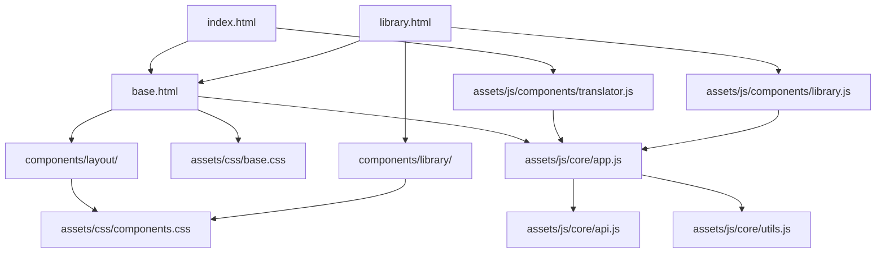

# Templates 模块重构计划

## 📋 重构概述

基于对现有 templates 目录的深入分析，制定本重构计划以实现模板系统的现代化、模块化和可维护性提升。

## 🎯 重构目标

### 主要目标
1. **模块化架构** - 将单体模板分解为可重用的组件
2. **清理冗余** - 移除重复和过时的文件
3. **标准化结构** - 建立一致的文件组织规范
4. **性能优化** - 优化资源加载和缓存策略
5. **维护性增强** - 提高代码可读性和可维护性

### 具体收益
- 🔧 更容易维护和更新模板
- 🚀 更好的性能和加载速度  
- 📦 更清晰的模块依赖关系
- 🎨 更一致的视觉和交互体验
- 🧪 更容易进行测试和调试

## 📊 现状分析

### 当前文件结构问题

```
templates/ (当前状态)
├── 📄 重复文件多
│   ├── index.html, index-new.html, index-themed.html, index-backup.html
│   ├── library.html, library-original.html, library-debug.html
│   └── 4个不同版本的index，3个版本的library
├── 📁 CSS 分散且重复  
│   ├── main.css (基础样式)
│   ├── theme-base.css (主题基础)
│   ├── library*.css (6个library相关CSS文件)
│   └── 样式冗余，难以维护
├── 📁 JavaScript 模块混乱
│   ├── monolith-translator.js (主功能)
│   ├── library-*.js (4个library模块)
│   ├── scroll-sync-fix.js, simple-scroll-sync.js (功能重复)
│   └── theme-manager.js (主题管理)
└── 📁 组件结构不清晰
    ├── components/ 目录存在但利用率低
    ├── 5个HTML组件文件
    └── 与主模板集成度不高
```

### 识别的问题

1. **文件冗余严重**
   - 4个index版本，功能重叠
   - 3个library版本，维护成本高
   - 2个滚动同步脚本，功能重复

2. **依赖关系复杂**
   - CSS文件间存在样式覆盖
   - JavaScript模块耦合度高
   - 组件间接口不明确

3. **命名不一致**
   - 文件命名风格不统一
   - 模块功能边界模糊
   - 版本管理混乱

4. **文档过时**
   - TODO文档内容与实际不符
   - 迁移文档描述的API不存在
   - 模块说明文档不完整

## 🏗️ 新架构设计

### 目标文件结构

```
templates/ (重构后)
├── 📁 core/                    # 核心模板
│   ├── base.html              # 基础HTML模板
│   ├── index.html             # 主页模板
│   └── library.html           # 库管理页面模板
├── 📁 components/             # 可重用组件
│   ├── layout/
│   │   ├── header.html        # 页面头部
│   │   ├── navbar.html        # 导航栏
│   │   └── footer.html        # 页面脚部
│   ├── library/
│   │   ├── toolbar.html       # 工具栏组件
│   │   ├── table.html         # 数据表格
│   │   ├── pagination.html    # 分页组件
│   │   └── stats.html         # 统计卡片
│   └── common/
│       ├── loading.html       # 加载状态
│       ├── error.html         # 错误提示
│       └── confirm.html       # 确认对话框
├── 📁 assets/
│   ├── css/
│   │   ├── base.css           # 基础样式
│   │   ├── components.css     # 组件样式
│   │   ├── layout.css         # 布局样式
│   │   ├── themes.css         # 主题样式
│   │   └── responsive.css     # 响应式样式
│   ├── js/
│   │   ├── core/
│   │   │   ├── app.js         # 应用主类
│   │   │   ├── api.js         # API通信
│   │   │   ├── utils.js       # 工具函数
│   │   │   └── events.js      # 事件管理
│   │   ├── components/
│   │   │   ├── library.js     # 库管理功能
│   │   │   ├── translator.js  # 翻译功能
│   │   │   ├── theme.js       # 主题管理
│   │   │   └── ui.js          # UI交互
│   │   └── vendors/
│   │       └── (第三方库)
│   └── config/
│       ├── app.json           # 应用配置
│       ├── api.json           # API配置
│       └── features.json      # 功能开关
└── 📁 legacy/                 # 遗留文件 (临时保留)
    ├── bookmarklet.html       # 书签工具
    └── specialized/           # 特殊用途文件
```

### 模块依赖关系



## 📋 重构步骤规划

### Phase 1: 结构重组 (高优先级)

#### 1.1 创建新目录结构
```bash
# 创建核心目录
mkdir -p templates/{core,components/{layout,library,common},assets/{css,js/{core,components,vendors},config},legacy}

# 移动现有资源到对应位置
# 清理重复文件
```

#### 1.2 文件分类和清理
- ✅ 已完成备份创建
- 🔄 识别要保留的核心文件
- 🔄 标记要删除的冗余文件
- 🔄 规划文件迁移路径

#### 1.3 依赖关系分析
- 🔄 分析CSS文件间的依赖
- 🔄 分析JavaScript模块依赖
- 🔄 确定组件接口规范

### Phase 2: CSS 重构 (中优先级)

#### 2.1 CSS 模块化
```css
/* 新的CSS架构 */
base.css          /* 基础样式、重置、变量 */
├── layout.css    /* 页面布局、网格系统 */
├── components.css /* 组件样式 */
├── themes.css    /* 主题定义 */
└── responsive.css /* 响应式设计 */
```

#### 2.2 样式整合策略
- 合并重复的样式定义
- 提取共同的变量和混入
- 建立一致的命名规范
- 优化选择器性能

### Phase 3: JavaScript 重构 (中优先级)

#### 3.1 模块化架构
```javascript
// 新的JS架构
core/
├── app.js        // 应用主类，启动和配置
├── api.js        // API通信封装
├── utils.js      // 工具函数集合
└── events.js     // 事件管理系统

components/
├── library.js    // 库管理功能模块
├── translator.js // 翻译功能模块  
├── theme.js      // 主题管理模块
└── ui.js         // 通用UI交互
```

#### 3.2 功能整合策略
- 消除功能重复的模块
- 建立清晰的模块接口
- 实现模块间松耦合
- 优化加载和执行性能

### Phase 4: HTML 模板重构 (中优先级)

#### 4.1 模板层次结构
```html
<!-- base.html: 基础模板 -->
<!DOCTYPE html>
<html>
<head>
  <!-- 共用头部内容 -->
</head>
<body>
  
  
  
</body>
</html>

<!-- index.html: 继承base模板 -->


  <!-- 首页特定内容 -->

```

#### 4.2 组件化策略
- 提取可重用的HTML片段
- 建立组件参数传递机制
- 实现组件条件渲染
- 优化模板渲染性能

### Phase 5: 集成和测试 (高优先级)

#### 5.1 Rust 集成更新
```rust
// 更新模板处理器以支持新结构
impl TemplateRenderer {
    fn render_with_components(&self, template: &str, context: &Context) -> String {
        // 支持组件包含和模板继承
        // 处理资源内联和优化
    }
}
```

#### 5.2 测试验证
- 功能测试：确保所有功能正常
- 性能测试：验证加载速度提升
- 兼容性测试：确保浏览器兼容
- 集成测试：验证与后端集成

### Phase 6: 文档和清理 (低优先级)

#### 6.1 文档更新
- 更新README和使用指南
- 编写组件使用文档
- 更新API接口文档
- 创建开发指南

#### 6.2 最终清理
- 删除不再需要的文件
- 更新构建配置
- 优化部署流程
- 版本标记和发布

## ⏱️ 时间估算

| 阶段 | 预估时间 | 优先级 | 依赖关系 |
|------|----------|--------|----------|
| Phase 1: 结构重组 | 1-2天 | 高 | - |
| Phase 2: CSS重构 | 2-3天 | 中 | Phase 1 |
| Phase 3: JS重构 | 2-3天 | 中 | Phase 1 |
| Phase 4: HTML重构 | 1-2天 | 中 | Phase 2,3 |
| Phase 5: 集成测试 | 1-2天 | 高 | Phase 4 |
| Phase 6: 文档清理 | 1天 | 低 | Phase 5 |

**总预估时间**: 8-13天

## 🎯 成功标准

### 功能性标准
- ✅ 所有现有功能保持正常工作
- ✅ 页面加载时间不变或提升
- ✅ 浏览器兼容性保持
- ✅ 响应式设计正常

### 技术性标准  
- ✅ CSS文件数量减少50%以上
- ✅ JavaScript模块依赖关系清晰
- ✅ HTML模板复用率提升80%
- ✅ 代码重复率降低60%

### 可维护性标准
- ✅ 文件组织结构清晰
- ✅ 命名规范一致
- ✅ 文档完整准确
- ✅ 开发者友好

## 🚨 风险管控

### 识别的风险
1. **功能回归** - 重构过程中破坏现有功能
2. **性能下降** - 不当的模块化导致性能问题
3. **集成问题** - 与Rust后端集成出现问题
4. **浏览器兼容** - 新结构导致兼容性问题

### 缓解策略
1. **渐进式重构** - 分阶段进行，每个阶段都充分测试
2. **功能保护** - 保留原有文件作为回滚选项
3. **性能监控** - 每个阶段都进行性能测试
4. **兼容性测试** - 在多个浏览器环境中验证

## 📞 下一步行动

### 立即行动项
1. ✅ 创建详细的重构计划（本文档）
2. 🔄 开始Phase 1: 创建新目录结构
3. 🔄 分析和分类现有文件
4. 🔄 确定保留/删除的文件清单

### 本周目标
- 完成Phase 1和Phase 2
- 建立新的CSS架构
- 开始JavaScript模块重构

### 本月目标  
- 完成所有重构工作
- 通过全面测试验证
- 更新相关文档
- 发布重构版本

---

**创建时间**: 2025-07-25  
**版本**: v1.0  
**负责人**: Template重构团队  
**审批状态**: 待审批